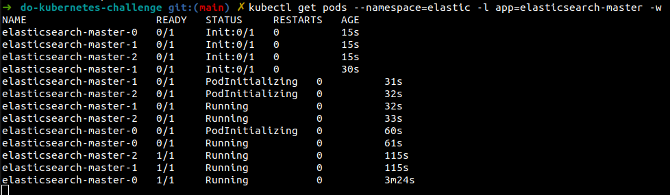
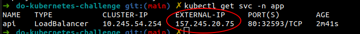
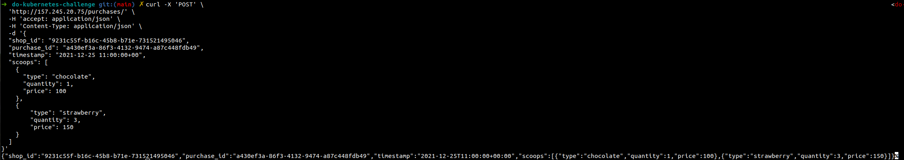
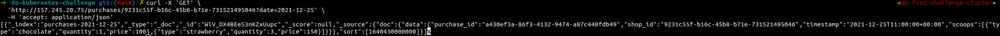

# Digital Ocean Kubernetes Challenge

## Task
[Digital Ocean Kubernetes Challenge](https://www.digitalocean.com/community/pages/kubernetes-challenge):
```
Deploy a scalable message queue
A critical component of all the scalable architectures are message queues used to
store and distribute messages to multiple parties and introduce buffering. Kafka
is widely used in this space and there are multiple operators like Strimzi or to
deploy it. For this project, use a sample app to demonstrate how your message
queue works.
```

## Prerequisites
* [doctl](https://github.com/digitalocean/doctl)
* [kubectl](https://kubernetes.io/docs/tasks/tools/install-kubectl-linux/)
* [terraform](https://www.terraform.io/downloads)
* [Digital ocean personal token](https://docs.digitalocean.com/reference/api/create-personal-access-token/)
* [Helm3](https://helm.sh/docs/intro/install/)

## Setup

### Create Kubernetes Cluster
* Export token which will be used to authenticate terraform with Digital Ocean
```
export DIGITALOCEAN_TOKEN=<Personal Token Generated as Prerequisite>
```
* Terraform resources are located inside `terrafom` folder
```
cd terraform
```
* Initialize terraform
```
terraform init
```
* Review terraform plan
```
terraform plan
```
* Apply terraform plan
```
terraform apply
```

This will create a kubernetes cluster inside a VPC with 3 nodes.

Terraform will output the generated cluster ID which can be used to create a kubeconfig.
```
doctl kubernetes cluster kubeconfig save <Cluster ID Output>
```
* Return to project root folder for further setup actions
```
cd ..
```

### Setup Kafka
[Strimzi](https://strimzi.io/) will be used to provision Kafka inside the kubernetes cluster.
* Create a separate namespace for kafka resources
```
kubectl create namespace kafka
```
* Apply Strimzi installation file
```
kubectl create -f 'https://strimzi.io/install/latest?namespace=kafka' -n kafka
```
* Provision the Kafka cluster
```
kubectl apply -f kafka_k8s/kafka-persistent.yaml  -n kafka
```
* Wait for the cluster to be provisioned
```
kubectl wait kafka/cluster --for=condition=Ready --timeout=300s -n kafka
```
* Setup Kafka Topic
```
kubectl apply -f kafka_k8s/kafka-topic.yaml -n kafka
```

### Setup ElasticSearch
This setup was not required by the task, however the sample application uses elasticsearch for saving events.
* Create namespace for elastic resources
```
kubectl create namespace elastic
```
* Add elastic helm charts repo
```
helm repo add elastic https://helm.elastic.co
```
* Update local helm chart repository cache
```
helm repo update
```
* Install elasticsearch
```
helm install elasticsearch elastic/elasticsearch -n elastic
```
* Wait until elasticsearch is provisioned
```
kubectl get pods --namespace=elastic -l app=elasticsearch-master -w
```


## Sample Application
Code for the sample application is located inside the [sample_app](sample_app/README.md) folder.
Application is a simple data processing pipeline:
- Ice cream purchase events are sent to API
- Received events are forwarded to Kafka
- Kafka consumer processes events and saves them to elasticsearch
- Saved events can be fetched over the API.

Application docker image is prebuilt and pushed to [docker hub](https://hub.docker.com/repository/docker/ademirovic/do-k8s-challenge).

### Deploy Sample App
* Create namespace for application resources
```
kubectl create namespace app
```
* Deploy app
```
kubectl apply -f deployment -n app
```
* Wait until the api is deployed
```
kubectl rollout status deployment/api --namespace=app --watch=true --timeout=180s
```
* Check is consumer is deployed
```
kubectl rollout status deployment/consumer --namespace=app --watch=true --timeout=180s
```

### Test Sample App
For this simple use case, the sample application is exposed to public internet with a Kubernetes service type `LoadBalancer` which provisions a [digital ocean load balancer](https://www.digitalocean.com/products/load-balancer/).
* Get the external IP of the load balancer.
**NOTE:** if it says provisioning, then wait a few minutes and run the command again. It may take some time for the load balancer to be provisioned.
```
kubectl get svc -n app
```


* The API docs can be accessed on `<loadbalancer ip>/docs`. Example: http://157.245.20.75/docs
* Send purchase events to the application
```
curl -X 'POST' \
  'http://157.245.20.75/purchases/' \
  -H 'accept: application/json' \
  -H 'Content-Type: application/json' \
  -d '{
  "shop_id": "4451fb53-1af4-4cd2-bd23-4d0872cad99b",
  "purchase_id": "3a5bb282-f5cf-4e7e-97b5-b98146f37fcf",
  "timestamp": "2021-12-30 12:00:00+00",
  "scoops": [
    {
      "type": "chocolate",
      "quantity": 2,
      "price": 200
    }
  ]
}'
```


* Get purchase events for specific shop and date
```
curl -X 'GET' \
  'http://157.245.20.75/purchases/4451fb53-1af4-4cd2-bd23-4d0872cad99b?date=2021-12-30' \
  -H 'accept: application/json'
```

